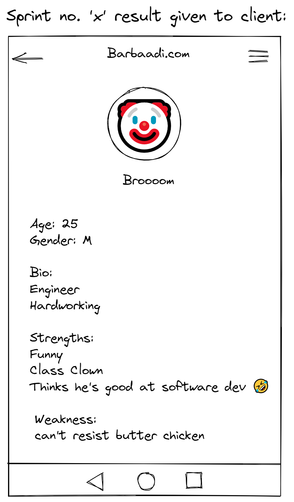

# Understanding DevOps with an analogy.

## Analogy
- Lets take a senerio wherein a matrimonial webapp is to be developed as per client's requirements, lets call it 'Barbaadi.com' (😜😜).
- It's taken up by a company and given to one of it's manager's team.

- We will understand this using following methodologies:
    - Waterfall
    - Agile

## Waterfall model
- In this model, development is done in top down approach and once a step is completed, its very difficult to revert to previous step in case of unexpected changes in the required project by the clients.
- Following is development side.

- Following is operations side.

## Drawback of waterfall model
- Now, in the above waterfall model, if the client asks for changes after many builds have been done, it will become difficult for the development team to actually refactor or modify the code and again follow the steps.
- For eg: the Barbaadi.com app had username and password for login and it was built and deployed as version_1.
- But now, the client wants to add OTP verification along with username and password, this OTP feature addition may take up good amount of development time and code refactoring or modification and the project may get delayed from the estimated delivery time.

## Agile model
- Agile model follows build short and built often method.
- This model delivers the project in the form of chunks or parts.
- The part or chunk of a project is called a 'sprint'.
- The framework of this method of delivering is known as 'Scrum'.
- All the sprints have the development and operations steps as well. This will allow features in sprint 'x' to be delivered to client and then the client can test those set of released features and provide improvement/feedback.

## Advantages
- Advantage of this Agile model is that if a client requests some change in between of development of a feature of the project, that change can be easily made into that part of the project. This part is known as a sprint and the change requested, can be made within that sprint.
- For eg: in the following picture the project is being delivered using agile method and features are divided into sprints. 
- If let's say, client requests a change or new feature suggestion, during sprint 1, that change can be easily made into it since the set of features are specific to that sprint only.

## Understanding Agile using an analogy
- Consider our example of 'Barbaadi.com' a matrimonial website.
- Let's consider sprint no. 'x' is completed and its given to client.
- This sprint x had profile page of the potential candidate as a completed feature.

- But the client wanted an addition in the UI, client asked to add salary in the bio as well. (Since salary is a biggest concern when performing arranged marriage, just kidding lollll.)

- So the dev team can now easily add the additional change in the sprint no. X and re-deploy it and then move on to the next sprint (sprint no. x+1) with new set of features.

- So this is how Agile was better than waterfall model.

## Drawback of Agile
- Silos problem