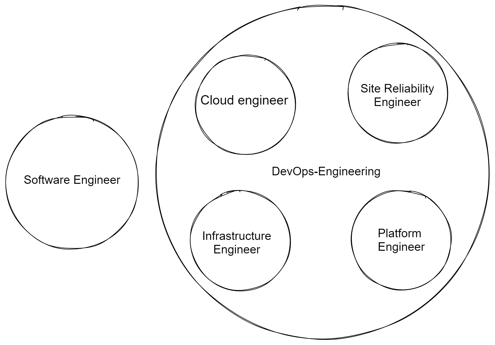

# Miscellaneous and FAQs

## Difference between DevOps Engineer, Site Reliability Engineer, Cloud Engineer, Software Engineer - Infrastructure, Platform Engineer?

A <b>Software Engineer</b> is someone who writes software code, whether it's the application code, test code, or deployment code.

A <b>DevOps Engineer</b> is someone who specialises in the latter deployment code, they generally write infrastructure as code, deployment pipelines, and other automation. These can be members of a DevOps team that can own the production environment(s) for engineering teams, or can be members of engineering teams and own their portion of the production environment.

A <b>Cloud Engineer</b> is a specialist DevOps Engineer who exclusively works with the cloud while a DevOps Engineer can also work with on-premise based environments. These can be embedded in engineering teams or a Cloud team.

A <b>Platform Engineer</b> is another subset of devops, where it would deal with the software performance, fixes, updates. It is a DevOps Engineer who works within a Platform team to provide a set of tools to make engineering teams' deployments easy and high quality.

An <b>Infrastructure Engineer</b> is another specialist DevOps Engineer who works either within an Infrastructure team or engineering team to provide cloud or on-premise resources to their customer or team. Dealing mainly with managing servers where they are etc, but don’t care about the software.

A <b>Site Reliability Engineer</b> is a narrow specialism of DevOps Engineer who works within Google's definition of Site Reliability Engineering. These generally form a SRE team and work with multiple teams to implement projects to improve the team's DevOps practices.

There's huge overlap in these roles. Engineers in these roles will all be doing the same work 50% - 80% of the time, bar Software Engineers. There will be more discrepancy based on the DevOps culture within the company than there is between these roles.