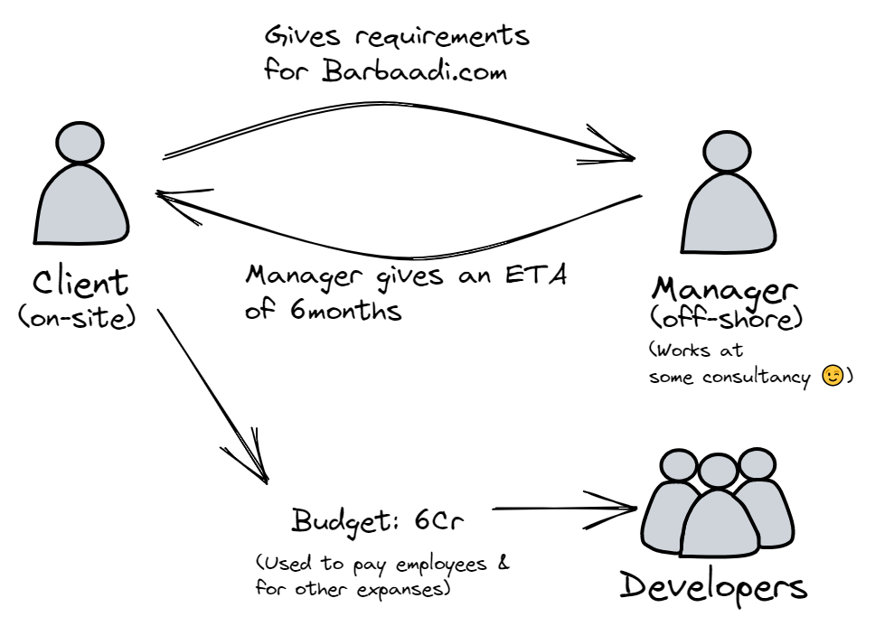
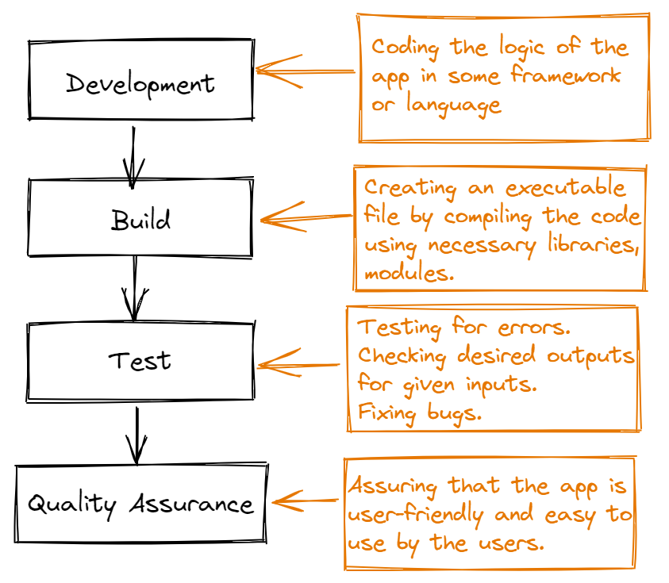
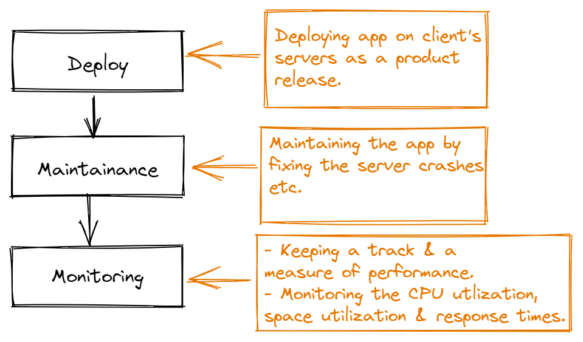

# Understanding DevOps with an analogy.

## Analogy
- Lets take a senerio wherein a matrimonial webapp is to be developed as per client's requirements, lets call it 'Barbaadi.com' (😜😜).
- It's taken up by a company and given to one of it's manager's team.

- We will understand this using following methodologies:
    - Waterfall
    - Agile

## Waterfall model
- In this model, development is done in top down approach and once a step is completed, its very difficult to revert to previous step in case of unexpected changes in the required project by the clients.
- Following is development side.

- Following is operations side.

## Drawback of waterfall model
- Now, in the above waterfall model, if the client asks for changes after many builds have been done, it will become difficult for the development team to actually refactor or modify the code and again follow the steps.
- For eg: the Barbaadi.com app had username and password for login and it was built and deployed as version_1.
- But now, the client wants to add OTP verification along with username and password, this OTP feature addition may take up good amount of development time and code refactoring or modification and the project may get delayed from the estimated delivery time.